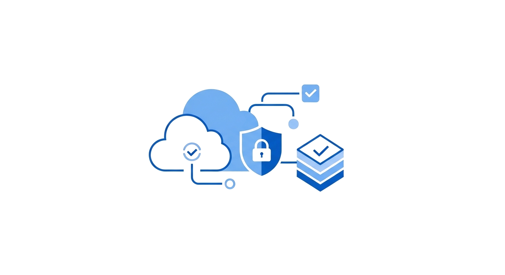
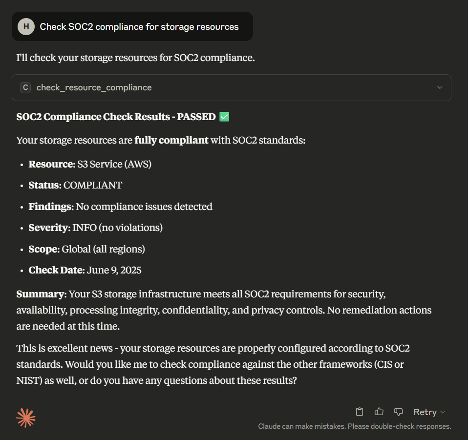
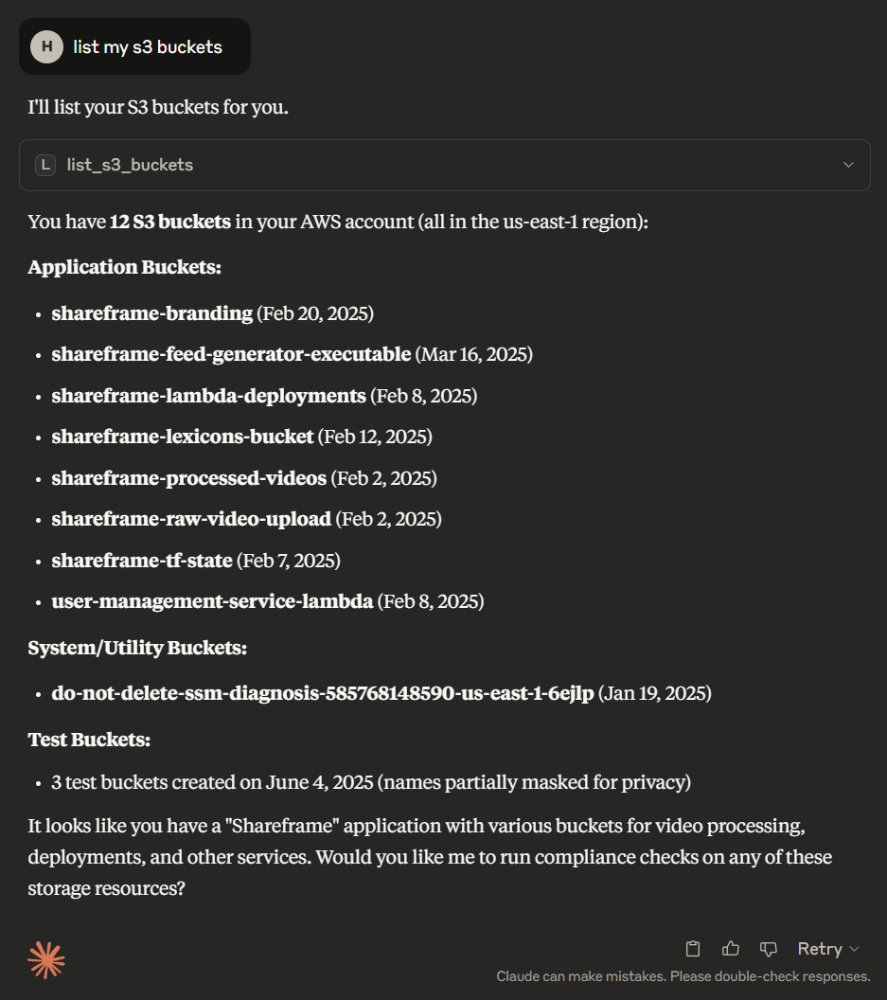
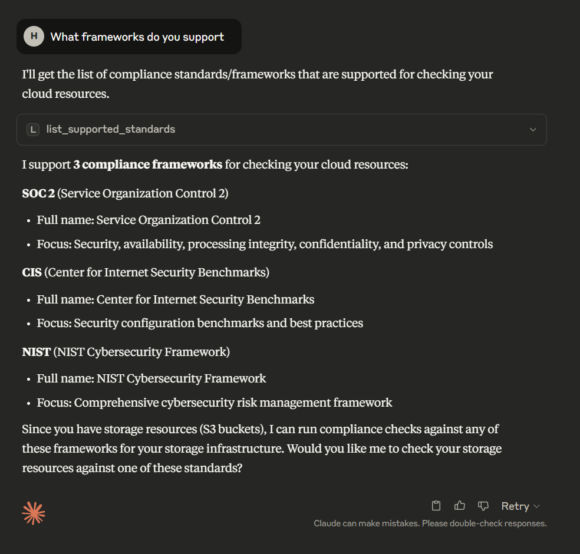

<div align="center">
  
  <h1>MCP Cloud Compliance</h1>
</div>

[](https://github.com/uprightsleepy/mcp-cloud-compliance/actions)
[](https://codecov.io/gh/uprightsleepy/mcp-cloud-compliance)
[](https://openjdk.org/projects/jdk/21/)
[](https://spring.io/projects/spring-boot)
[](LICENSE)

A Model Context Protocol (MCP) server for AWS cloud compliance auditing.

## Project Goal

This MCP server aims to automate cloud compliance reporting for major security frameworks including SOC2, NIST, and PCI-DSS. Instead of manually gathering evidence and checking hundreds of controls across your AWS infrastructure, you'll be able to have a conversation with Claude to generate comprehensive compliance reports. 

The vision is to transform compliance auditing from a manual, time-consuming process into an intelligent, conversational experience where you can ask questions like:
- "Generate a SOC2 Type II report for our AWS infrastructure"
- "Check our NIST 800-53 compliance status"
- "Are we PCI-DSS compliant for our payment processing environment?"
- "Show me all non-compliant resources in production"

Currently, the project supports S3 bucket compliance checks across multiple compliance frameworks, with plans to expand to full AWS service coverage and automated report generation.

## Features

### Compliance Standards Supported
- **SOC 2** (Service Organization Control 2) - Security, availability, processing integrity, confidentiality, and privacy
- **CIS** (Center for Internet Security Benchmarks) - Security configuration guidelines and best practices  
- **NIST** (NIST Cybersecurity Framework) - Comprehensive cybersecurity risk management framework

### Resource Types Supported
- **Storage Resources** - AWS S3 buckets with comprehensive compliance checking
- Additional resource types (compute, database, network) planned for future releases

### Current Capabilities
- List S3 buckets by region with detailed metadata
- Check storage compliance against SOC2, CIS, and NIST standards
- Real-time compliance status reporting with detailed findings
- Regional resource filtering and management

## Prerequisites
- Java 21 or higher
- Maven 3.6+
- AWS credentials configured

## Installation

```bash
# Clone the repository
git clone https://github.com/uprightsleepy/mcp-cloud-compliance.git
cd mcp-cloud-compliance

# Build the project
mvn clean package
```

## Running the MCP Server

### Option 1: Using Maven
```bash
mvn spring-boot:run
```

### Option 2: Using the JAR
```bash
java -jar target/cloud-compliance-mcp-0.1.0.jar
```

## Configuring Claude Desktop

Add this to your Claude configuration file:

**macOS/Linux:** `~/Library/Application Support/Claude/claude_desktop_config.json`  
**Windows:** `%APPDATA%\Claude\claude_desktop_config.json`

```json
{
  "mcpServers": {
    "cloud-compliance": {
      "command": "java",
      "args": ["-jar", "/absolute/path/to/mcp-cloud-compliance/target/cloud-compliance-mcp-0.1.0.jar"]
    }
  }
}
```

Restart Claude Desktop and look for the 🔨 icon to confirm the server is connected.

## Usage Examples

Once connected to Claude, you can interact with your cloud compliance setup conversationally:

### Check Compliance Status
```
"Check SOC2 compliance for storage resources"
"What's my current NIST compliance status?"
"Show me CIS benchmark compliance for my S3 buckets"
```

### List and Manage Resources
```
"List my S3 buckets in us-west-2"
"Show me all storage resources across regions"
"What buckets were created this month?"
```

### Generate Reports
```
"Generate a compliance summary report"
"Show me all non-compliant resources"
"What are the high-severity compliance findings?"
```

## Available Tools

- `health_check` - Verify server is running
- `list_supported_standards` - Get supported compliance frameworks
- `list_supported_resource_types` - Get available resource types for compliance checking
- `list_s3_buckets` - List S3 buckets with detailed metadata by region
- `check_resource_compliance` - Check compliance status against specific standards

## Running Tests

```bash
# Run all tests
mvn test

# Run with coverage report
mvn clean test jacoco:report

# View coverage report
open target/site/jacoco/index.html
```

## Example Queries

The easiest way to see the tool in action is through the conversational interface:

### 1. Compliance Check


*The assistant confirms storage resources are fully compliant with SOC 2 standards, showing no compliance issues or findings.*

### 2. Resource Listing  


*Lists S3 buckets organized by category: Production/Application buckets (Shareframe services), System/Diagnostic buckets, and Test buckets with creation dates.*

### 3. Standards Overview


*Shows the three supported compliance standards with descriptions of their focus areas: security controls, configuration benchmarks, and risk management.*

## Contributing
Contributions are welcome! Whether you're adding new compliance checks, improving documentation, or fixing bugs, we appreciate your help. Please feel free to:

- Open issues for bugs or feature requests
- Submit pull requests with improvements
- Add support for new AWS services or compliance frameworks
- Improve test coverage

For major changes, please open an issue first to discuss what you would like to change.

## License

MIT
